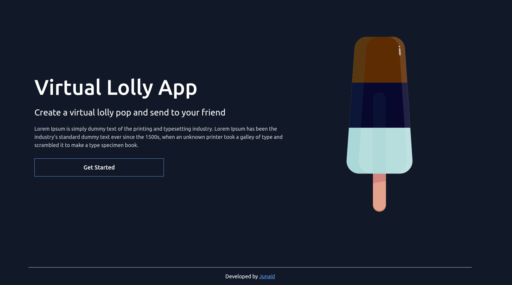
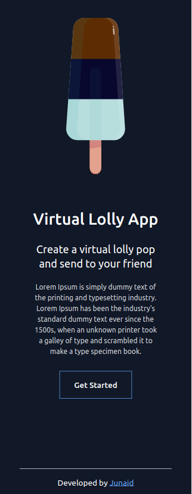

# Virtual Lolly App (JAM Stack)

### _Virtual Lolly  Application using Serverless JAM Stack (Gatsby, GraphQL, FaunaDB, Serverless Functions) !!_

### Video :link: https://youtu.be/98S4NPzgjM8

### Link :link: https://virtual-lolly-jamstack.netlify.app/

## Desktop

## Mobile

## Run Locally

- Run this command `git clone https://github.com/developer-junaid/Virtual-Lolly-JAMStack.git`
- You are now in the dev environment and you can play around

## Tech Stack

- HTML
- Tailwind-css
- GraphQl
- FaunaDB
- FQL
- GatsbyJs
- Netlify Serverless Functions
- Formik
